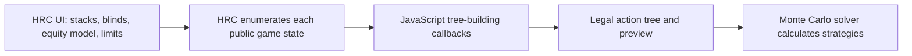

# HRC scripted tree building research

## Research status

This document records desk research completed on 10 August 2026. It covers
the public HRC scripting documentation, current public API reference, official
example scripts, tree configuration guidance, and relevant release notes.

No HRC calculation was created or started for this research. HRC was not
opened, and no local HRC file, licence material, or private configuration was
inspected.

This document is a technical reference. It is not observed feasibility
evidence. Record later observations from the licensed host in
[`feasibility.md`](feasibility.md).

The public API URL contains `latest` rather than a fixed product version.
Treat this document as a dated snapshot. Confirm the installed HRC Beta
version and its behaviour before implementation.

## Executive summary

HRC scripting is a tree-building facility. It is not a general HRC automation
or batch-processing API.

The user interface still supplies the stacks, blinds, equity model, maximum
active-player limit, and postflop abstraction settings. During tree creation,
HRC calls JavaScript functions to decide:

- which preflop raise-to sizes are available;
- which postflop bet or raise-to sizes are available;
- whether a preflop limp or flat call is available;
- whether a postflop flat call is available; and
- whether betting continues on later streets.

HRC applies the general poker rules and builds the resulting action tree. The
Monte Carlo solver then calculates strategies for that tree. A script defines
the available actions. It does not define hand ranges or action frequencies.



One script can support calculations with different and mixed stack sizes. The
script receives the current pot and stack state at every decision. It can
select a sizing rule by position, previous actions, the project's dynamic
effective stack, or stack-to-pot ratio (SPR). This is more maintainable than a
separate fixed script for every stack size when the underlying rule set is
shared.

The most important limitation is that the documented API exposes no hole
cards, ranges, board cards, or board texture. Postflop rules can depend on the
street, action history, position, player count, pot, stacks, and SPR. They
cannot depend on the flop, turn, or river cards through the documented API.

## Product scope and prerequisites

The [official scripting guide](https://www.holdemresources.net/docs/scripting/)
states that scripted tree building is available only for Monte Carlo hands and
requires an HRC Pro licence.

The public documentation does not state that these scripts apply to HRC's
[separate dedicated postflop calculations](https://www.holdemresources.net/docs/postflop/).
Treat that workflow as unsupported until it is documented or demonstrated on
the licensed host.

Scripts use JavaScript. HRC executes them through the Graal JavaScript engine.
The Java API pages are reference contracts; scripts themselves are not Java.
Official examples use plain files with top-level callbacks, configuration
values, and helper functions. They do not use a class or module export wrapper.
The public documentation does not specify an ECMAScript version or module and
import support.

The documented loading workflow is:

1. Start a new Advanced Monte Carlo hand.
1. Configure the stacks, blinds, and equity model in HRC.
1. Open the betting setup.
1. Select the **Scripting** tab.
1. Use **Open Script** to load a `.js` file.
1. Wait for HRC to estimate the resulting tree.
1. Review the tree figures and preview.
1. Select **Finish** to create the tree.

Loading a script starts tree estimation. It does not start the full Monte Carlo
solve. The official guide states that the same script can be reused for any
number of calculations.

## Execution model

The
[`ITreeBuildingScript`](https://www.holdemresources.net/s/updatesites/hrc/latest/scripting/javadoc/net/holdemresources/scripting/treescripts/api/ITreeBuildingScript.html)
contract contains five callbacks.

| Callback | Purpose | Result |
| --- | --- | --- |
| `getSizingsPreflop(ctx)` | Define raises at the current preflop decision. | Zero or more raise-to amounts. |
| `getSizingsPostflop(ctx)` | Define bets or raises at the current postflop decision. | Zero or more bet or raise-to amounts. |
| `canFlatCallPreflop(ctx)` | Allow a preflop limp or flat call. | Boolean. |
| `canFlatCallPostflop(ctx)` | Allow a postflop flat call. | Boolean. This callback is optional and defaults to `true`. |
| `hasNextStreetBetting(ctx)` | Decide whether betting can continue on later streets. | Boolean. `false` forces a checkdown to showdown. |

The four callbacks other than `canFlatCallPostflop` are treated as required by
the current official examples and API documentation.

None of the official examples implements `canFlatCallPostflop`. Its documented
default of `true` therefore preserves postflop calls when the callback is
omitted.

### Returned sizing rules

The sizing callbacks describe bet or raise-to amounts, not raise increments.
The declared return type is an array of zero or more amounts.

HRC normalises returned amounts:

- A negative amount is discarded.
- A non-negative amount below the legal minimum is raised to the minimum.
- An amount above the effective all-in is reduced to the effective all-in.
- An empty array removes betting or raising at that decision.

Do not use zero to mean "no raise". The API contract implies that zero is
normalised to the minimum legal size. Return an empty array instead.

The documentation does not state whether HRC removes duplicate sizes after
normalisation. Confirm this in the tree preview.

### Java and JavaScript array interoperation

Some HRC methods return Java arrays. The official guide instructs scripts to
wrap these values with `Array.from(...)` before using JavaScript array methods.
This applies to methods such as:

- `ctx.sizingsPreflop(...)`;
- `ctx.sizingsPostflop(...)`;
- `ctx.getActionSequence()`;
- `ctx.getActionSequence(street)`; and
- `ctx.getActionSequenceFull()`.

Return JavaScript arrays consistently from sizing callbacks. Some official
examples return a scalar for a one-size branch, although the API declares an
array return. This is an official source inconsistency and is `TO CONFIRM` on
the installed version.

### Stateless evaluation

The official guide says that callback results must depend on the supplied
decision context. Do not use mutable global or external state to remember the
path through the tree.

Top-level constants and rule tables are consistent with the official examples.
Do not mutate them while HRC enumerates the tree. Use `let` or `const` for loop
variables and local values. Several old examples omit local declarations, so
they are not suitable as style templates without review.

## Decision context

The
[`IDecisionContext`](https://www.holdemresources.net/s/updatesites/hrc/latest/scripting/javadoc/net/holdemresources/scripting/treescripts/api/IDecisionContext.html)
object represents one public decision point. It exposes the following state.

| Method | Meaning |
| --- | --- |
| `getActivePlayer()` | Index of the player who is making the current decision. |
| `getNumberOfPlayers()` | Number of players at the table. |
| `getPlayerIndexButton()` | Button player index. |
| `getPlayerIndexSmallBlind()` | Small blind player index. |
| `getPlayerIndexBigBlind()` | Big blind player index. |
| `getStreet()` | `PREFLOP`, `FLOP`, `TURN`, or `RIVER`. |
| `getBetCount()` | Bets or raises on the current street. The blinds count as the first preflop bet. |
| `getFlatCallCount()` | Flat calls against the latest bet or raise on the current street. |
| `getLastRaiseAction()` | Most recent bet or raise in the entire hand, or `null` if none exists. |
| `getActionSequence()` | Actions on the current street. |
| `getActionSequence(street)` | Actions on a selected street. `-1` means the current street. |
| `getActionSequenceFull()` | Actions for the entire hand. |
| `getPotState()` | Current pot, stack, folded-player, and all-in state. |
| `getStackPotRatio()` | Effective remaining stack divided by the pot after the current player calls. |
| `isClosingAction()` | Whether a check or call closes the current street's action. |
| `isDonkBet()` | Whether a bet now would be a donk bet. |
| `isPlayerInBlinds(player)` | Whether a player is in the small or big blind. |
| `isPlayerInPosition(a, b)` | Whether player `a` has postflop position on player `b`. |
| `getSizeBigBlind()` | Nominal big blind in HRC amount units. |
| `getSizeSmallBlind()` | Nominal small blind in HRC amount units. |
| `getSizeAnte()` | Nominal ante per player in HRC amount units. |

`getLastRaiseAction()` is hand-wide, not street-local. On a flop before any
postflop bet, it normally refers to the last preflop aggressor. Use the current
street's action sequence when a rule requires the latest raise on that street
only.

The official definition of `getStackPotRatio()` is line-sensitive. If an
uncalled bet or raise exists, HRC adds the current player's call to the pot
before calculating SPR.

### Bet counts before and after a 3-bet

The blinds count as bet number one preflop. Therefore:

| `ctx.getBetCount()` | Current preflop state | Next raise returned by `getSizingsPreflop` |
| ---: | --- | --- |
| 1 | No voluntary raise | Open raise or isolation raise. |
| 2 | Open raise exists | 3-bet or squeeze. |
| 3 | 3-bet exists | 4-bet response. |
| 4 | 4-bet exists | 5-bet response. |
| 5 | 5-bet exists | 6-bet response. |

This explains why the official default script adds one to `getBetCount()`
before selecting functions named for the next bet.

## Player indexing and positions

Player indices are constant for the complete hand. Index zero is the first
player to act preflop.

The API gives these examples:

- Three-handed: `[0] BU`, `[1] SB`, `[2] BB`.
- Five-handed: `[0] HJ`, `[1] CO`, `[2] BU`, `[3] SB`, `[4] BB`.

The API has direct helpers only for the button, small blind, and big blind.
The official guide recommends deriving other positions relative to the button.
For example, the cutoff is `button - 1` in a normal non-straddled layout.

Any reusable position helper must also consider:

- the table size;
- heads-up button and blind conventions;
- absent players, if supported by the selected workflow; and
- single, double, or button straddles.

Straddle-specific player helpers are not present in the documented scripting
API. Straddled configurations are `TO CONFIRM` separately.

HRC's release notes say that a straddle is an additional blind rather than a
raise: calling it is a limp and raising it is an open. The normal bet-count
sequence should therefore still apply, but the dated scripting examples
predate straddle support. Validate each required straddle mode separately.

## Action records

Each
[`IPlayerAction`](https://www.holdemresources.net/s/updatesites/hrc/latest/scripting/javadoc/net/holdemresources/scripting/treescripts/api/IPlayerAction.html)
contains:

| Method | Meaning |
| --- | --- |
| `getActionType()` | `FOLD`, `CHECK`, `CALL`, or `RAISE`. Bets and raises both use `RAISE`. |
| `getAmount()` | Zero for folds and checks, the effective amount to call for calls, and the final raise-to amount for raises. |
| `getPlayer()` | Constant player index. |
| `getStreet()` | Street index. |

The script constants `FOLD`, `CHECK`, `CALL`, `RAISE`, `PREFLOP`, `FLOP`,
`TURN`, and `RIVER` can be used directly. The documented street values are
zero through three, but named constants are clearer.

Action sequences enable rules for circumstances that have no dedicated API
method. Examples include:

- identifying the original opener after a 3-bet;
- distinguishing a normal 3-bet from a squeeze;
- finding whether the active player acted earlier on the street;
- detecting a previous-street aggressor;
- detecting a check-raise pattern; and
- applying different rules after one or more callers.

## Pot and stack state

The
[`IPotState`](https://www.holdemresources.net/s/updatesites/hrc/latest/scripting/javadoc/net/holdemresources/scripting/treescripts/api/IPotState.html)
object exposes:

| Method | Meaning |
| --- | --- |
| `getChipsActive(player)` | Chips currently in front of a player as a blind, call, bet, or raise. |
| `getChipsDead(player)` | Chips contributed earlier that are no longer active. |
| `getChipsRemaining(player)` | Chips still in the player's stack. |
| `getChipsTotalPot()` | Sum of all active and dead chips. |
| `getStreet()` | Street index for this pot state. |
| `hasPlayerFolded(player)` | Whether the player has folded. |
| `isPlayerAllIn(player)` | Whether the player has no chips remaining. |
| `countPlayersFolded()` | Number of folded players. |
| `countPlayersLive()` | Number of players who are neither folded nor all-in. |
| `countPlayersAllIn()` | Number of all-in players. |

HRC represents chip amounts as one hundred internal units per chip. If the big
blind is 50 chips, `getSizeBigBlind()` returns 5,000. Use HRC sizing helpers and
ratios instead of absolute internal amounts where possible.

The blind and ante getters return the full nominal value even if a short player
cannot post that amount in full.

### Project effective-stack convention

The API does not provide a named `getStartingStack(player)` or
`getEffectiveStack(playerA, playerB)` method.

For this project, calculate a player's total stack from the documented chip
components:

```text
player total = active chips + dead chips + remaining chips
largest non-folded opponent total = maximum player total among other players who have not folded
project effective stack = minimum of the active player total and largest non-folded opponent total
project effective stack in bb = project effective stack / nominal big blind
```

Recalculate this value for the active player at every callback. A fold can
therefore change the effective stack even when no chips move. Folded chips stay
in the pot, but the folded player no longer qualifies as an opponent.

Include every opponent who has not folded, including a player who is all-in.
Do not use `countPlayersLive()` to build the opponent set. That method excludes
all-in players as well as folded players.

For example, CO and BU each have 100 bb. SB and BB each have 10 bb. CO's
effective stack is initially 100 bb because BU remains eligible. If CO folds,
BU's effective stack is 10 bb because only the two 10 bb blinds remain.

This convention is a project decision. It is not the active player's uncapped
stack, the shortest opponent, the last raiser's stack, remaining chips, or
SPR. The last raiser can still determine the action class or positional rule,
but does not determine the stack bucket. Treat a decision with no non-folded
opponent as an invalid state instead of assigning it to a zero-stack bucket.

This calculation is an inference from the public API. Confirm it against the
HRC tree preview and table-state view before using it in a calculation.

`ctx.sizingAllIn()` gives HRC's effective all-in bet or raise-to size at the
current decision. Use it only as HRC's legal raise-to cap. It is not the
project effective-stack metric. The documentation does not define which
opponent determines that value in every multiway state. That detail is
`TO CONFIRM`.

## Sizing helpers

The context provides helpers that convert relative rules into HRC amounts.

| Helper | Meaning |
| --- | --- |
| `sizingBigBlinds(n)` | Bet or raise to `n` big blinds. |
| `sizingMinimum()` | Minimum legal bet or raise-to amount. |
| `sizingAllIn()` | Effective all-in bet or raise-to amount. |
| `sizingPot(fraction)` | Pot-relative bet or raise. Use `0.5` for half pot. |
| `sizingGeometric(numberBets)` | Geometric size that gets effective stacks in over the requested number of bets or raises. |
| `sizingGeometricHint(fraction)` | Geometric size closest to the preferred pot fraction. |
| `sizingsPreflop(text)` | Parse one or more preflop sizes using HRC's UI syntax. |
| `sizingsPostflop(text)` | Parse one or more postflop sizes using HRC's UI syntax. |

In multiway pots, `sizingGeometric(...)` assumes that only two players continue
after the next bet or raise.

### Preflop sizing text

The
[tree configuration guide](https://www.holdemresources.net/docs/tree-config/)
and `sizingsPreflop(...)` API document this syntax.

| Format | Meaning |
| --- | --- |
| `2.5bb` or `2.5` | Raise to 2.5 big blinds. |
| `3.0x` | Raise to three times the previous raise amount. |
| `75%` | Pot-relative raise. |
| `all-in` or `ai` | Raise all-in for effective stacks. |
| `2.5bb, all-in` | Return multiple sizes. |
| `2.5bb + 1bb` | Add 1 big blind for each limper. |
| `2.5bb + 1bb + 0.5bb` | Add 1 big blind for the first limper and 0.5 for each additional limper. |
| `3.0x + 1.0x` | Add one previous-raise multiple for each flat caller. |

The official guide recommends big-blind sizes mainly for opening. It recommends
pot percentages or previous-raise multiples for 3-bets and later raises because
those values adapt to earlier actions.

The current default example uses mixed-unit expressions such as a fixed
big-blind base plus a previous-raise multiple for callers. This demonstrates a
compact squeeze adjustment. The API text does not document every mixed-unit
combination, so validate each intended expression in HRC.

The API documents `all-in` and `ai`. Some official examples use `allin`
without a hyphen. Use the documented spellings unless the installed version is
explicitly tested.

### Postflop sizing text

`sizingsPostflop(...)` documents:

| Format | Meaning |
| --- | --- |
| `75%` | Bet or raise 75% of the pot. |
| `75g` | Select the geometric size closest to 75% pot. |
| `2e` | Select the geometric size that gets all-in over two bets. |
| `3.0x` | Bet or raise to three times the most recent bet or raise amount. |
| `all-in` or `ai` | Bet or raise all-in for effective stacks. |
| `50%, 75%` | Return multiple sizes. |

The API does not document what an `x` expression means on an unopened
postflop street, how malformed expressions fail, whether result order is
preserved, or whether equivalent sizes are deduplicated after legal
normalisation. Do not rely on any of those behaviours without testing them.

The Javadoc still labels `sizingsPostflop(...)` as beta-only. Scripted tree
building later shipped in stable HRC Pro. Treat this label as a source-freshness
warning and confirm the installed HRC Beta behaviour.

## Mapping the API to the required sizing rules

### Position-specific opening sizes

Use the active player index and the position helpers. Direct helpers cover BU,
SB, and BB. Derive other positions relative to BU, with table-size checks.

The official default example has separate open values for:

- other positions;
- BU;
- SB; and
- BB.

A custom script can split the "other" group into UTG, HJ, CO, or other table
positions.

### Stack-dependent 3-bet sizes

This requirement is feasible with the documented API.

At a 3-bet decision, the script can inspect:

- the active 3-bettor;
- the opener from `getLastRaiseAction()`;
- every player's chip components and folded state;
- whether the 3-bettor has postflop position;
- blind positions;
- the open raise amount;
- the number of callers; and
- the current SPR.

Select one sizing rule for the current node. Do not return the union of every
stack bucket's sizes at every node. Conditional selection keeps the tree small.

Relative formats already adapt to some changing inputs:

- `x` formats adapt to the open or previous raise;
- `%` formats adapt to the pot;
- caller adjustments adapt to limps and flats;
- all-in thresholds adapt to the effective all-in; and
- geometric postflop sizes adapt to SPR.

Explicit stack buckets are required only when poker policy changes at a stack
threshold. Select the bucket from the project effective stack. Define exact
lower and upper boundary ownership to avoid gaps or overlaps.

### Squeezes and isolation raises

`getFlatCallCount()` identifies callers before the current action. The action
sequence identifies who called and from which positions.

The current preflop text parser supports per-limper and per-caller adjustments.
The dated Advanced MTT example also demonstrates explicit squeeze branches by
IP, SB, and BB, with an extra amount for each additional caller.

The dated PKO example demonstrates:

- different first-limper and over-limper adjustments;
- different IP and OOP isolation adjustments;
- a special BB-versus-SB-complete size; and
- squeeze multipliers based on the previous raise.

### Responses to 3-bets

When `getBetCount()` is three, the current player is facing a 3-bet.

The script can control three structural responses:

- Folding remains a legal action managed by HRC.
- `canFlatCallPreflop(ctx)` controls whether calling is in the tree.
- `getSizingsPreflop(ctx)` supplies the available 4-bet sizes.

The callback can branch on the responder, 3-bettor, original opener, IP or OOP
status, action history, project effective stack, and SPR.

At this bet count, scan the active player's latest current-street action to
classify the responder:

- `RAISE` means the original raiser is responding to the 3-bet;
- `CALL` means a prior caller is responding to a squeeze; and
- no prior voluntary action means a cold player is responding.

This classification lets the sizing and call callbacks apply different rules
to each role. It is more precise than applying one generic "facing a 3-bet"
rule to every player.

The script cannot set which hands call, fold, or 4-bet. HRC calculates those
strategies. Use HRC node locking or frequency locking when the goal is to force
a strategy rather than define an action tree.

### Flat-call rules

One Boolean callback controls preflop limps and calls. The script can use the
bet count and action history to distinguish:

- open limps;
- the SB complete;
- calls against opens;
- calls against 3-bets or later raises;
- cold calls;
- overcalls; and
- calls that close the action.

The official default permits one ordinary flat against opens, 3-bets, and
4-bets. It can also permit an extra flat when that call closes the action.
Therefore, the configured ordinary-flat count is not always the total number
of callers.

The default checks for a closing call before it rejects cold calls or applies
the ordinary-flat cap. Its closing-call exception therefore overrides both of
those restrictions.

HRC release notes state that a player who cannot legally re-raise after an
incomplete all-in raise is allowed to call regardless of the configured flat
rule. The tree builder prevents that player from being forced out of the pot.

### Postflop sizing rules

The documented API supports state-dependent rules for:

- flop, turn, and river;
- bets versus raises;
- continuation bets;
- donk bets;
- check-raises, derived from action history;
- IP versus OOP;
- heads-up versus multiway pots;
- number of live or all-in players;
- current SPR;
- previous aggression; and
- a maximum number of bets or raises, implemented from `getBetCount()`.

`isDonkBet()` uses this official definition: betting before the previous
street's last aggressor has acted. It returns `false` if that aggressor is
all-in.

The current default example uses separate geometric hints for heads-up and
multiway pots. It optionally adds flop-only fixed pot sizes, c-bet-only sizes,
and all-in below a configured SPR.

That example treats a state as heads-up when `countPlayersLive()` is two. The
method excludes folded and all-in players, so this means two players still
capable of acting, not necessarily only two players eligible for the pot.
Do not reuse this count for the project effective-stack calculation.

The [tree configuration guide](https://www.holdemresources.net/docs/tree-config/)
recommends keeping postflop trees simple when the primary goal is reliable
preflop ranges. Geometric sizes cope well with the wide SPR variation produced
by mixed stacks and different preflop lines.

## What scripting does not control

The public scripting API does not expose methods to:

- enter or change stacks, blinds, antes, payouts, bounties, or the equity model;
- select postflop abstraction bucket counts;
- set the maximum active-player limit;
- start, monitor, cancel, save, or export a calculation;
- select an output filename;
- define hole-card ranges or strategy frequencies;
- inspect hole cards, board cards, or board texture;
- inspect calculated equity or EV while building the tree; or
- control HRC windows outside the betting-tree setup.

These boundaries follow from the complete current public API package, which
contains only `ITreeBuildingScript`, `IDecisionContext`, `IPlayerAction`,
`IPotState`, and `IPlayerAction.ActionType`.

The absence of application lifecycle methods is important for this project.
Tree scripting can produce the desired configuration, but a separate supported
UI automation method is still required to create, run, detect, and save a
simulation.

## Tree size and correctness risks

Every additional size can create another branch. Additional calls also create
multiway postflop branches. Tree size can grow very quickly.

The official guidance recommends these controls:

- allow fewer flat calls;
- avoid unnecessary multiple bet sizes;
- use larger postflop sizes where they are acceptable;
- limit later-street betting in large multiway pots; and
- reduce postflop abstraction sizes if memory remains a problem.

The UI's maximum active-player limit is enforced before all other tree
settings. When the limit is reached, HRC forces remaining players to fold.
The guide recommends a limit of at least two plus the allowed ordinary flat
calls against an open. Confirm closing-call exceptions in the preview.

Two configuration mistakes can produce misleading ranges:

- Non-all-in raises without calls produce an artificial raise-or-fold game.
- Flat calls with postflop betting disabled assume a checkdown and can produce
  unrealistically wide calling ranges.

Script validity is therefore not enough. The generated abstract game must also
represent the intended poker model.

## Official examples

### Current default example

The
[current default script](https://www.holdemresources.net/docs/scripting/default_example.js)
is the best official starting point. It uses the current preflop text parser
and demonstrates:

- position groups for opens and 3-bets;
- IP and OOP 4-bet and 5-bet sizes;
- an all-in threshold;
- an SPR rule that adds all-in;
- flat, cold-call, and closing-call rules;
- heads-up and multiway geometric postflop sizes;
- optional flop and c-bet sizes;
- donk restrictions; and
- street limits for multiway pots.

Its all-in replacement threshold is `0.37`. For a player with chips already
active, the comparison point is:

```text
active chips + (effective all-in raise-to - active chips) * threshold
```

A proposed raise-to amount at or above that point is replaced by effective
all-in. This is a distance-to-all-in rule, not 37% of the pot or starting stack.

The complete current default configuration is:

| Area | Default example value |
| --- | --- |
| Other-position and BU open | `2.3bb` |
| SB and BB open or isolation base | `3.5bb` |
| Non-blind 3-bet | `6.9bb + 1.0x` |
| BB 3-bet versus SB | `9.0bb + 1.0x` |
| BB 3-bet versus another position | `9.2bb + 1.0x` |
| SB 3-bet versus BB | `9.2bb + 1.0x` |
| SB 3-bet versus another position | `8.1bb + 1.0x` |
| IP 4-bet and 5-bet | `90%, allin` |
| OOP 4-bet and 5-bet | `120%, allin` |
| Preflop all-in replacement | Threshold `0.37`; add all-in at SPR at or below `7` |
| Ordinary preflop flats | One at bet counts 2, 3, and 4; none at 5 and 6 |
| Other preflop calls | Cold calls off; closing calls on; only SB may call at bet count 1 |
| Heads-up postflop sizes | Geometric hints `50%` and `75%` |
| Multiway postflop sizes | Geometric hints `60%` and `80%` |
| Extra flop sizes | `33%` for all unopened flops; no extra c-bet-only size |
| Postflop all-in | Add at SPR at or below `5` |
| Donks | General donks off; permitted for a player who raised earlier in the hand |
| Last regular betting street | River with 2 or 3 live players, turn with 4, flop with 5; unlisted counts force a checkdown |

These values mirror HRC's basic UI setup. Use the structure as a reference, but
do not treat its numeric sizes as poker-policy requirements for this project.

### Dated Advanced MTT example

The
[Advanced MTT example](https://www.holdemresources.net/docs/scripting/mtt_advanced_20211029.js)
is dated 29 October 2021. It demonstrates explicit squeeze handling and direct
numeric sizing helpers. It generally permits only the SB to limp.

### Dated PKO example

The
[PKO limping example](https://www.holdemresources.net/docs/scripting/pko_limps_20211206.js)
is dated 6 December 2021. It demonstrates limps, over-limps, isolation rules,
position-sensitive additions, and previous-raise multipliers.

### Fixed-limit example

The
[fixed-limit example](https://www.holdemresources.net/docs/scripting/example_fixed_limit.js)
demonstrates that the callbacks can describe a game other than the default
no-limit pattern. It caps action at four bets and allows postflop betting only
heads-up.

### Example caveats

The dated examples predate later tree-builder fixes and current JavaScript
guidance. They contain legacy techniques, including:

- using a very large pot fraction as an all-in sentinel;
- manually multiplying HRC internal amounts;
- 32-bit bitwise truncation;
- scalar returns where the API declares arrays; and
- undeclared loop variables.

Prefer the current parser and sizing helpers. Copy an old technique only after
the installed HRC version confirms its behaviour.

## Version-sensitive history

The [HRC release notes](https://www.holdemresources.net/news) show why version
validation matters.

| Date | Relevant change |
| --- | --- |
| 12 October 2021 | Added scripted tree building for Monte Carlo mode. |
| 29 October 2021 | Added Advanced MTT and PKO examples and the tree preview. |
| 9 November 2021 | Fixed pot-sized raises that mainly affected custom scripts. |
| 25 January 2022 | Exposed many previously script-only options in the UI and added UI tree-setup save and load. |
| 27 April 2022 | Fixed postflop minimum raises and incomplete all-in action reopening. |
| 29 June 2022 | Added hand configuration JSON saves and ways to restore prior hand setup. |
| 2 August 2022 | Always allowed calls when an incomplete raise prevents a legal re-raise. |
| 28 April 2023 | Released HRC v3 stable and moved the preceding Beta feature set into the stable product. |
| 8 January 2024 | Added straddles and rewrote significant tree-generation code. |
| 16 January 2024 | Added a general OOP 3-bet UI setting for limped and straddled lines. |
| 18 January 2024 | Fixed `getLastRaiseAction()` after it briefly returned only the current street's last raise. |
| 18 September 2024 | Added post-creation action editing and a UI bets-per-street setting. These are separate from script loading. |
| 18 October 2024 | Released HRC v4 stable. No scripting API change was listed. |
| 4 February 2026 | HRC 4.1 moved the 2025 Beta changes into stable. No scripting API change was listed. |

Historical bugs do not establish current defects. They show that an old script
and an old HRC version can generate different trees.

The `latest` Javadocs were generated on 17 June 2024 and are older than the
current product release. The scripting guide also contains a broken duplicate
link to an obsolete API package path. Use the working links in this document
and confirm the live API before implementation.

The tree configuration guide also retains a 25,000-node HRC Classic limit,
whereas current pricing states 50,000. Its sizing grammar remains useful, but
do not treat its product-limit values as current without a separate check.

## Known gaps to confirm on the licensed host

- `TO CONFIRM`: Exact installed HRC Beta version and HRC Pro entitlement.
- `TO CONFIRM`: Exact accessible labels and keyboard path for the Scripting tab
  and Open Script control.
- `TO CONFIRM`: Error presentation for syntax errors and callback runtime
  errors.
- `TO CONFIRM`: Whether editing a loaded file triggers a reload or requires
  Open Script again.
- `TO CONFIRM`: Whether a saved hand configuration embeds the script source,
  stores a path, or stores only the generated tree settings.
- `TO CONFIRM`: Scalar sizing returns versus the documented array contract.
- `TO CONFIRM`: Duplicate sizes after minimum, maximum, or all-in
  normalisation.
- `TO CONFIRM`: Exact multiway opponent selection used by `sizingAllIn()` and
  `getStackPotRatio()`. This does not change the project's separate
  effective-stack convention.
- `TO CONFIRM`: Mixed-unit preflop parser combinations needed by the final
  rules.
- `TO CONFIRM`: Position and bet-count semantics for every required straddle
  mode.
- `TO CONFIRM`: Nominal ante and pot-state semantics for a big blind ante and
  partially posted forced bets.
- `TO CONFIRM`: Whether the preview exposes enough node detail to verify all
  stack-bucket boundaries without creating a calculation.

No public script logger, debugger, standalone runner, unit-test runner, CLI
assignment method, or validation command is documented. The HRC estimate and
preview are the documented validation surface.

## Project sizing policy

Record project decisions in [`hrc-script-design.md`](hrc-script-design.md).
That document is the single project-policy record.

The policy must cover table sizes, position mapping, straddles, stack mapping,
all preflop action classes, call availability, all-in rules, postflop rules,
the maximum active-player limit, and postflop abstractions. Do not implement a
policy category that is still marked `TBD` unless the first iteration isolates
it explicitly for review.

## Safe first-time validation sequence for a future script

Follow this candidate tree validation sequence on the licensed host only. Use
the project [`README.md`](../README.md) for authorised calculation and Viewer
save operations.

1. Confirm the HRC version and Pro entitlement without exposing licence data.
1. Start from a fresh copy of the current official default script.
1. Add only the agreed sizing policy.
1. Load the script into a new disposable Monte Carlo setup.
1. Wait for the tree estimate to complete.
1. Stop if HRC reports a script or tree error.
1. Review the tree preview for every required position and bet level.
1. Verify the project effective stack for every active player in the supplied
   100/100/10/10 example.
1. Inspect the branch where the deep CO folds. Verify that BU changes from
   100 bb to 10 bb.
1. Verify that folded opponents are excluded and non-folded all-in opponents
   remain eligible.
1. Check a value immediately below, on, and above each stack threshold.
1. Check regular 3-bets, squeezes, and 4-bet responses separately.
1. Check original raisers, prior callers, and cold players when facing 3-bets.
1. Check calls, cold calls, closing calls, and the active-player limit.
1. Check minimum-raise adjustment, effective all-in clamping, and incomplete
   raises.
1. Check heads-up and multiway postflop branches.
1. Check each street and each value below, on, and above every SPR threshold.
1. Verify that normalised sizes are legal and not unintentionally duplicated.
1. Record observable evidence in `feasibility.md`.
1. Stop after recording the generated-tree evidence.

Do not infer correctness from a successful script load. Verify the generated
tree. Stop at any critical step that requires an unidentified control or blind
coordinate click.

## Recommended design direction

Use one reviewed rule specification as the source of truth. Keep stack buckets,
position rules, call rules, all-in rules, and postflop rules separate in that
specification.

Use [`hrc-script-design.md`](hrc-script-design.md) as the current design and
decision record. It compares the sizing workbook, the archived shared
prototype, and the two project-owned working candidates.

Keep one standalone script per materially different configuration family. The
current 3–6-max and HU workflows have different stack grids, position models,
and preflop action grammar, so they use separate candidates. Keep common
postflop policy aligned through shared regression vectors because the HRC
loader has no documented module-import mechanism.

Keep the HRC script separate from the application automation. The script owns
the action tree. The future automation owns UI navigation, observable state,
safe output naming, and lifecycle handling.

Explicitly requested project candidates can be stored for offline review before
application-automation feasibility is complete. Keep them labelled
unvalidated. Do not treat them as observed feasibility evidence.

## Sources

Primary sources retrieved on 10 August 2026:

- [HRC scripted tree building guide](https://www.holdemresources.net/docs/scripting/)
- [HRC tree configuration guide](https://www.holdemresources.net/docs/tree-config/)
- [HRC dedicated postflop calculation guide](https://www.holdemresources.net/docs/postflop/)
- [Scripting API package](https://www.holdemresources.net/s/updatesites/hrc/latest/scripting/javadoc/net/holdemresources/scripting/treescripts/api/package-summary.html)
- [`ITreeBuildingScript` API](https://www.holdemresources.net/s/updatesites/hrc/latest/scripting/javadoc/net/holdemresources/scripting/treescripts/api/ITreeBuildingScript.html)
- [`IDecisionContext` API](https://www.holdemresources.net/s/updatesites/hrc/latest/scripting/javadoc/net/holdemresources/scripting/treescripts/api/IDecisionContext.html)
- [`IPlayerAction` API](https://www.holdemresources.net/s/updatesites/hrc/latest/scripting/javadoc/net/holdemresources/scripting/treescripts/api/IPlayerAction.html)
- [`IPlayerAction.ActionType` API](https://www.holdemresources.net/s/updatesites/hrc/latest/scripting/javadoc/net/holdemresources/scripting/treescripts/api/IPlayerAction.ActionType.html)
- [`IPotState` API](https://www.holdemresources.net/s/updatesites/hrc/latest/scripting/javadoc/net/holdemresources/scripting/treescripts/api/IPotState.html)
- [Scripting constants](https://www.holdemresources.net/s/updatesites/hrc/latest/scripting/javadoc/constant-values.html)
- [Current default example](https://www.holdemresources.net/docs/scripting/default_example.js)
- [Advanced MTT example](https://www.holdemresources.net/docs/scripting/mtt_advanced_20211029.js)
- [PKO limping example](https://www.holdemresources.net/docs/scripting/pko_limps_20211206.js)
- [Fixed-limit example](https://www.holdemresources.net/docs/scripting/example_fixed_limit.js)
- [HRC Monte Carlo sampling and node locking guide](https://www.holdemresources.net/docs/monte-carlo-sampling/)
- [HRC news and release notes](https://www.holdemresources.net/news)
- [HRC 4.1 stable release](https://www.holdemresources.net/blog/2026-hrc-v4-1-release/)
- [HRC Pro feature comparison](https://www.holdemresources.net/hrc/pricing)

Additional context was checked in the public HRC support thread on Two Plus
Two. Community posts were not used as API authority. The official guide points
to an HRC Discord `#scripting` channel for further examples and support. Pinned
Discord content was not available through the public web sources used for this
research.
